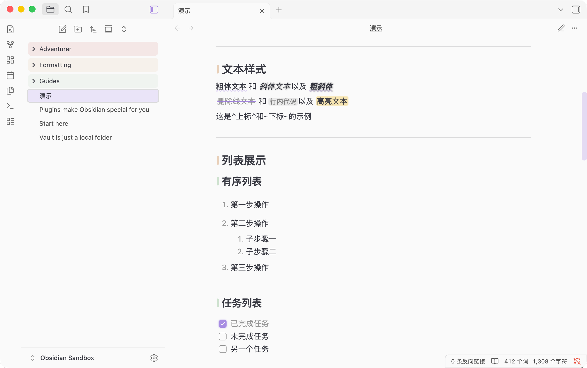

# Wen Theme

> 🎉 **全新 Obsidian 主题「Wen Theme」正式发布！**  
> 以「精致视觉 + 实用体验」为核心，为笔记创作打造兼具美感与效率的沉浸式环境。完美适配亮/暗双模式，覆盖从界面布局到文本样式的全场景自定义需求。



### 1. 丰富配色，随心切换🎨  
- **浅色主题 8 种风格**：熏衣紫（默认）、苔藓绿、潮汐蓝、活力橙、胭脂、青屿、拿铁、水墨，清新雅致，适配日间明亮阅读；  
- **深色主题 7 种质感**：暮霭紫（默认）、静谧绿、玄溟蓝、余辉橙、樱花粉、夜涌青、云石灰，深邃护眼，沉浸夜间专注模式🌙。

### 2. 界面美化，细节拉满🌟  
- **自定义界面元素**：支持半透明状态栏、按钮样式 Tab 栏、弹窗动画效果，打造流畅视觉体验；  
- **个性化文件管理**：彩虹文件夹样式 + 描边效果可选🌈，自定义文件图标区分不同类型文件📁，文件管理更直观；  
- **自定义启动页**：可修改加载页面的文字、字体和颜色，打造专属的打开仪式感，让每次启动都充满个性与期待🎁。

### 3. 排版优化，创作舒适✍️  
- **标题精细化控制**：增加编辑标题等级显示、灵动标题、悬停高亮效果和标题指示器；  
- **字体样式多样**：斜体阴影效果、粗体波浪线（默认显示/悬停触发可选），重点内容一目了然；  
- **文档属性优化**：支持隐藏、悬浮球收纳或正常显示三种模式，释放笔记顶部空间；  
- **首行缩进支持**：通过 CSS 类快速启用首行缩进，符合中文排版习惯📚。

### 4. 细节打磨，灵动体验👀  
- **多媒体优化**：图片支持圆角、外发光效果💡、反色及多种对齐方式，支持多图自适应横排；  
- **表格优化**：圆角设计 + 奇偶行背景区分，单元格悬停高亮，数据查看更清晰📊；  
- **链接样式**：增加链接图标、悬停背景，鼠标悬停高亮，提升可点击性与视觉反馈🔗；  
- **交互体验升级**：灵动选择框、代码块/引用块悬停放大、滚动条优化、聚焦指示器智能切换，沉浸式编辑体验拉满🎯。

### 5. 特色功能，高效实用💖  
- **旁注**：支持左侧/右侧旁注布局，适合添加批注、译文对照或侧边备注，排版更灵活📝；  
- **Emoji Callout**：自动为不同类型的 Callout 匹配对应的 Emoji 背景，让标注更生动有趣😉；  
- **分割线分页**：分割线可直接作为 PDF 导出时的分页符，轻松实现分页导出📄；  
- **下划线挖空**：将需要记忆的知识点隐藏，强迫大脑回忆，助力主动记忆复盘🧠；  
- **代码块增强**：支持显示代码行号、悬停放大，代码阅读更舒适；  
- **空白行优化**：自动压缩无效空白行，避免排版冗余，让笔记排版更紧凑整洁。

### 📖 使用方法

1. **安装依赖**：在 Obsidian 社区插件市场中搜索并安装 **Style Settings** 插件。  
2. **部署主题**：下载主题文件，将其放入仓库根目录下的 `.obsidian/themes` 文件夹中。  
3. **启用主题**：进入「设置 → 外观 → 主题」，在下拉列表中选择并启用该主题 ✅。  
4. **个性化定制**  
   - **全局设置**：在 Style Settings 面板中进行详细配置。  
   - **局部调用**：在笔记顶部的 YAML 区添加 `cssclass` 属性，启用单篇笔记专属样式。

###### **感谢所有测试用户的反馈与建议！如有问题或需求，欢迎留言交流。**  

```
🚀 Wen Theme | 灵动交互・实用至上  
✅ 极致灵动交互：选择框、滚动条、代码块等全维度动态反馈，操作丝滑有呼应；  
✅ 多效 CSS 加持：标题/表格/图片/排版全优化，自定义开关适配不同场景；  
✅ 舒适实用兼备：兼顾视觉美感与创作效率，让笔记编辑更顺手、更舒心。
```

### 📢 写给各位小伙伴的一封信

大家好！我是本主题的作者。

坦白说，我只是一个 **CSS 初学者**。这个主题的诞生，很大程度上要归功于 **AI 的强大辅助**，是它帮我实现了许多我原本搞不定的效果。但也正因为如此，代码里可能藏着不少 **Bug** 或者不够规范的地方。

此外，由于我的外语能力有限，目前主题还只有 **中文版**，没能照顾到使用英文界面的朋友。

**我想向大家发出两个小请求：**  
1. **求“拍砖”**：如果您懂前端或 CSS，发现代码写得不好、有冗余或者有更棒的写法，请一定不吝赐教！无论是提 Issue 还是直接改代码，都是对我最大的帮助。  
2. **求“翻译”**：如果有热心且精通英文（或其他语言）的小伙伴，愿意帮忙把主题翻译成多国语言，那简直是救星降临！

开源的魅力就在于大家聚在一起把东西做得更好。感谢每一位愿意停下来看这段文字的你，更感谢每一位愿意伸手相助的朋友！✨

📢 A Message to Fellow Friends

Hello everyone! I’m the author of this theme.

To be honest, I’m just a CSS beginner. The birth of this theme owes a lot to the powerful help of AI, which allowed me to realize many effects I couldn’t have achieved on my own. But because of that, there might be a number of bugs or not-so-standard code tucked away in the project.

Also, since my foreign language skills are limited, the theme is only available in Chinese for now, and I haven’t been able to accommodate friends who prefer an English interface yet.

I’d like to make two small requests to everyone:  
1. Feedback is welcome! If you’re into front-end or CSS and spot clumsy code, redundancy, or know a much better way to do something, please do share your insights! Whether opening an Issue or directly modifying the code, you’d be helping me a ton.  
2. Translations needed! If there’s anyone kind and fluent in English (or other languages) willing to help translate the theme into more languages, that would be an absolute lifesaver.

The beauty of open source is that we can all come together and make something better. Thank you to everyone who took the time to read this, and an even bigger thank you to those willing to lend a hand! ✨
